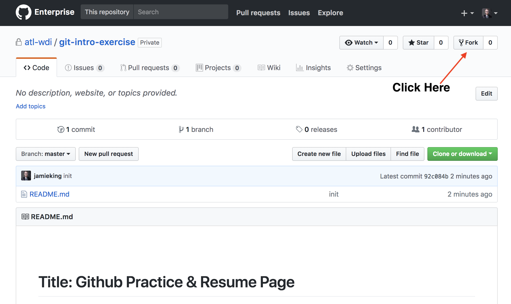

# Git and Github Practice
### Setup

1. Fork this repository on Github.
  
2. Clone your forked repository into the `~/wdi/exercises` directory (if you don't have this yet, go ahead and create the directory)
3. Move into the `git-intro-exercise` directory and create a file called `answers.md`.
4. Write your and answer the questions below in your `answers.md` file.
5. Commit your work at each point when directed (remember to `git add -A` and then `git commit -m "my message here"`).

### Directions

Refer back to the notes from today and/or use the internet to find the answers to the questions below:

#### Answer the following questions

1. What command do you use to setup a git repository inside of your folder?
2. What command do you use to ask git to start tracking a file?
3. What command do you use to ask git to move your file from the staging area to the repository? 
4. What command do you use to get updates from the class repository?
5. What command do you use to push your work to your fork of the class repository?

&#x1F534; **Commit your work.**  
The commit message should read:  
"The 1st set of GIT homework answers are complete"

1. What command do you use to unstage a file? 
1. What command do you use to change your files back to how they were after a commit? 
1. Why is it important to use `--` when chaging files back to a previous state? 
1. Why might you want to reset your files back to a previous commit? 

&#x1F534; ** Commit your work.**  
The commit message should read:  
"The 2nd set of GIT homework answers are complete".

## When You're Done

### Submission

 1. Inside this folder, you should now have a file called `answers.md`.

 2. You should have been adding and committing along the way, but please type `git status` one last time to make sure that everything is commited. If it's not, please commit.

 3. Push your local code back up to Github.

 4. Submit link to your Github repo

---

## Hungry for more?

- Check out this [tutorial](http://gitreal.codeschool.com/?utm_source=github&utm_medium=codeschool_option&utm_campaign=trygit) that includes videos about using git and some challenges for you to tackle.
