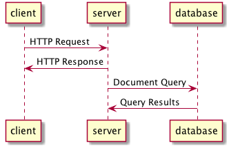
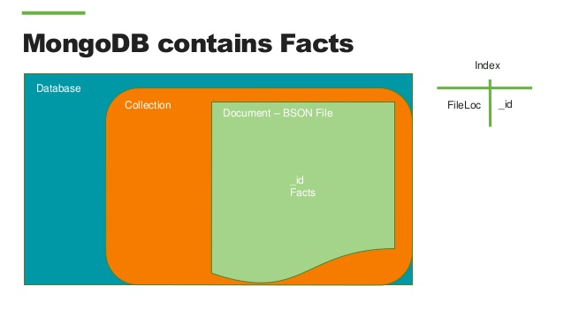
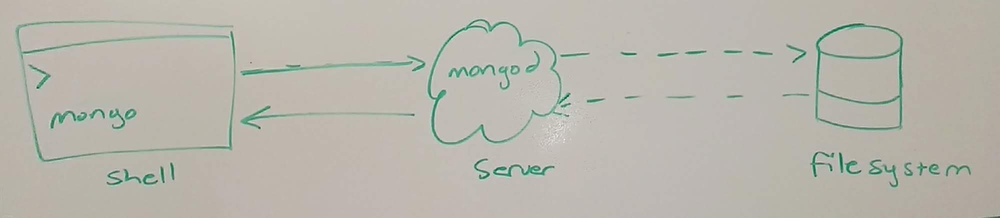
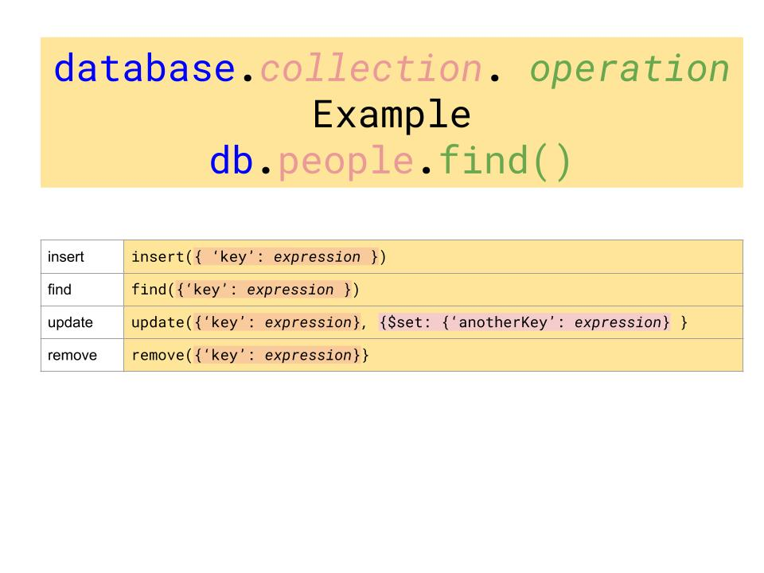
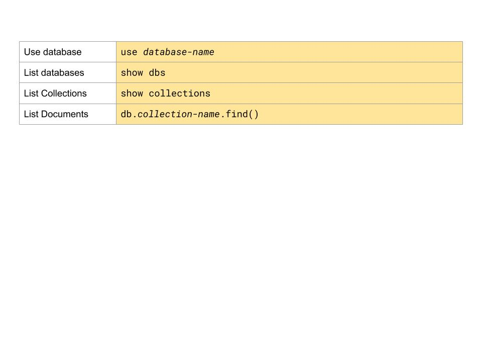

# MongoDB


## Learning Objectives

- Introduce databases, specifically non-relational databases
- Setup local MongoDB server
- Define what a document is in the context of MongoDB
- CRUD documents using Mongo CLI

## Framing

Why use a database at all?

What's a major shortcoming of our applications right now, in terms of user
experience?

When we quit or reload the page, any data / progress is lost! Right now, we can
only store information in memory, which is wiped when we quit out of a program.
We need a way to fix this.

Enter databases...



## Databases (15 minutes / 0:15)

A database is a tool for storing data. There are many ways to store data on a
computer (e.g., writing to a text file, a binary file). Databases, however,
offer a number of advantages...

**Permanence**: Once we write data to our database, we can be pretty sure it
won't be lost (unless the server catches on fire).

**Speed**: Databases are generally optimized to be fast at retrieving and
updating information. Literally, DBs can be 100,000x faster than reading from a
file. This is especially important at scale.

**Consistency**: Databases can enforce rules regarding consistency of data,
especially when handling simultaneous requests to update information.

**Scalability**: Databases can handle lots of requests per second, and many DBs
have ways to scale to massive loads by replicating / syncing information across
multiple DBs.

**Querying**: DBs make it easy to search, sort, filter and combine related data
using a **Query Language**.

**When dealing with less complex associations, non-relational databases can be more
effective**. Mongo provides a more flexible, scalable solution for storing data.

### Terminology

While this is a bit technical, it's worth clarifying some terminology...

Name                        | Description
----------------------------|-------------------------------------------------
Database                    |  The actual data being stored. (think literal files)
Database Management System  | The software tools to interact with your data (think Finder)
Database CLI                |  A command line tool to interact with the data (think the terminal)

## Document Database



### A Document

A basic example of a `Person` document:

```json
{
  "name": "Sue",
  "age": 26,
  "status": "Active",
  "groups": ["sass", "express"]
}
```

What do you see in the data above?

### Structure of Document

- a data structure composed of field (key) and value pairs
- similar to JSON objects ([JavaScript Object
  Notation](https://www.mongodb.com/json-and-bson) is a JS object converted
  into text to be parsed easily by machines)
- stored as BSON [(binary-encoded JSON)](http://bsonspec.org/ )

#### [Primary key](http://docs.mongodb.org/manual/reference/glossary/#term-primary-key) (5 min / 1:25)

- A record’s unique immutable identifier generated upon creation of a new
  instance.
- In relational databases, the primary key is usually an *id* field, the value
  of which is typically an *Integer*.
- In MongoDB, the *_id* field is usually a
  *[BSON](http://docs.mongodb.org/manual/reference/glossary/#term-bson)
  [ObjectId](http://docs.mongodb.org/manual/reference/glossary/#term-objectid)*.

[Documentation Here] (https://docs.mongodb.com/manual/introduction/)

### More complicated example of a `Restaurant` document:

```json
{
   "_id" : ObjectId("54c955492b7c8eb21818bd09"),
   "address" : {
      "street" : "2 Avenue",
      "zipcode" : "10075",
      "building" : "1480",
      "coord" : [ -73.9557413, 40.7720266 ],
   },
   "borough" : "Manhattan",
   "cuisine" : "Italian",
   "grades" : [
      {
         "date" : ISODate("2014-10-01T00:00:00Z"),
         "grade" : "A",
         "score" : 11
      },
      {
         "date" : ISODate("2014-01-16T00:00:00Z"),
         "grade" : "B",
         "score" : 17
      }
   ],
   "name" : "Vella",
   "restaurant_id" : "41704620"
}
```

## Collections (5 min / 0:30)

MongoDB stores documents in collections.

- used to group documents that have a similiar purpose 
- does **NOT** require its documents to have the same schema (format, shape)
- can have multiple collections in a database

Great, now that we have a high level understanding of what Mongo is and what
purpose it serves, let's look at how to use it!

## Installation / Starting (10 min / 0:40)

### Don't Do This Unless mongoDB is not installed

Check by running `mongo --version`. If you already have it installed you should
see output like this...

```sh
$ mongo --version

MongoDB shell version v3.6.6
git version: 6405d65b1d6432e138b44c13085d0c2fe235d6bd
OpenSSL version: OpenSSL 1.0.2n  7 Dec 2017
allocator: tcmalloc
modules: none
build environment:
    distmod: ubuntu1604
    distarch: x86_64
    target_arch: x86_64
```

If you already have mongo installed, skip to the **Mongo Shell** section.

Otherwise, follow the instructions below.

### Installation Instructions



#### Proceed only if you don't have installed! Consult the previous section.

If you already have mongo installed, skip to the **Mongo Shell** section.

- Mac OS X
    1. Install mongodb with brew

        ```bash
        brew install mongodb
        ```

    2. Create the folder mongo will be using to store your databases

        ```bash
        sudo mkdir -p /data/db
        ```

    3. Change permission so your user account owns this folder you just created

        ```bash
        sudo chown -R $(whoami) /data/db
        ```

    > Type these commands exactly as displayed, you don't need to substitute anything.

- [Linux Instructions on the mongodb website](https://docs.mongodb.org/manual/tutorial/install-mongodb-on-ubuntu/)

### Start Mongo:

Brew includes a really great tool for databases and applications you need
running in the background consistently.  In order to start our Mongo server, we
will run the following command.

```
brew services start mongodb
```

### More info?

```
$ brew info mongo
```

## Mongo shell (10 min / 0:50)


### Start the shell

Back in your original Terminal tab:

```
$ mongo
```

> feels a little bit like a JS REPL

You should see:

```
MongoDB shell version: 3.x.x
connecting to: test
>
```

> The > is a good sign that you've entered the terminal.

### Help

Type `help` to get a list of available commands.

```
> help
```

#### ThinkShare (2min):
Based on what you see in the help menu:
- What jumps out as important?
- What might be useful for debugging?

<details>
<summary>Some things that jump out:</summary>

- `db.help()` : help with database commands
- `show dbs`: show database names
- `show collections`:  show collections in current database
- `use <db_name>`: set current database
- `db.foo.find()`: list objects in collection foo

Also:

- `<tab>` key completion
- `<up-arrow>` and the `<down-arrow>` for history.
</details>

## CLI: Creating a Database

In the Mongo REPL, let's go ahead and create our first database, one which we
will be using to store information about restaurants.

In order to create/connect to a new database, we have to tell mongo to `use` a
specific database that we want to work with:

```
> use restaurant_db
```
> **Note**: `use` will create the database it received as an argument if not
> already initialized and connect to it

Verify:

```
> db
restaurant_db
```
> **Note**: the `db` variable is provided by mongo and will point to the
>  currently connected database


Common Gotcha - what happens when we run:

```
$ show dbs
```

> **Note**: we don't see `restaurant_db` listed. It isn't until we add a document to
our database that our db will show up in `show dbs`.

## CLI: Create a Document (15 min / 1:20)



### Insert

- use `insert()` to add documents to a collection

### Insert a restaurant

``` json
> db.restaurants.insert(
   {
      "name": "Cookies Corner",
      "address" : {
         "street" : "1970 2nd St NW",
         "zipcode" : 20001,
      },
      "yelp": "http://www.yelp.com/biz/cookies-corner-washington"
   })
```

**Important to note**:
> The `db` is the database we’re connected to. In this case, `restaurant_db`.
`.restaurants` is then referring to a collection in our `restaurant_db`. We
use the `.insert()` to add the document inside the parentheses.

> `restaurants` doesn't exist at first, but that's okay. It gets created
> automatically the first time we add a document to it.

### Verify the insert
```bash
> show collections

restaurants
```

`restaurants` was saved as a collection. A collection is really just a group of
documents. If you want to explore all the things you can do with a collection,
type `db.collection_name.help()`, or in this case: `db.restaurants.help()`

Now type:

```js
> db.restaurants.find()
```

Returns documents with the following fields:
- `name`
- `address`
- `yelp`

**Q**. What is surprising/unexpected?

- Where did `restaurants` come from?
- `_id`?


> Note: Documentation on [ObjectId](https://docs.mongodb.org/manual/reference/object-id/)

## Review `insert`
```js
// insert
> db.your_collection_name.insert({ data as json })
// find
> db.your_collection_name.find()
```

New Record:
- If the document passed to the `insert()` method does not contain the `_id`
  field the mongo shell automatically adds the field to the document and sets
  the field’s value to a generated `ObjectId`.

New collection:
- If you attempt to add documents to a collection that does not exist,
MongoDB will create the collection for you.

<!--
## Dropping a Database

```bash
> use database_to_be_dropped
> db.dropDatabase()
```

Drops the **current** database. Go ahead and drop your database now.
-->



### Exercise (5 minutes): Add a few more restaurants.

Using the Mongo Shell CLI, add at least 4 new restaurant documents to your
`restaurants` collection.

**ProTip**: I recommend you construct your statements in your editor and copy /
paste. It will help you now & later.

> Prompt: Did anyone insert multiple at one time?

Let's recreate the steps together:

<details>
	<summary>How can we tell which database we are connected to currently?</summary>

	> `db`
</details>

1. Create DB
2. Use the appropriate DB
3. Insert multiple restaurants

``` json
db.restaurants.remove({});
db.restaurants.insert([
  {
    "name": "Cookies Corner",
    "address": {
      "street" : "1970 2nd St NW",
      "zipcode" : 20001
    },
    "yelp": "http://www.yelp.com/biz/cookies-corner-washington"
  },
  {
    "name": "The Blind Dog Cafe",
    "address": {
      "street": "944 Florida Ave",
      "zipcode": 20001
    },
    "yelp": "http://www.yelp.com/biz/the-blind-dog-cafe-washington-2?osq=cookies"
  },
  {
    "name": "Birch & Barley",
    "address": {
      "street": "1337 14th St NW",
      "zipcode": 20005
    },
    "yelp": "http://www.yelp.com/biz/birch-and-barley-washington?osq=Restaurants+cookies"
  },
  {
    "name": "Captain Cookie and the Milk Man",
    "address": {
      "street": "Foggy Bottom",
      "zipcode": 20036
    },
    "yelp": "http://www.yelp.com/biz/captain-cookie-and-the-milk-man-washington-5"
  },
  {
    "name": "J's Cookies",
    "address": {
      "street": "1700 N Moore St",
      "zipcode": 22209
    }
  }
])

> db.restaurants.count()
```

> Note that there's no `yelp` key in the last record. Does that matter?

## Break (10 min / 1:35)

## CLI: QUERY for Records (25 min / 2:00)

<!--
Breaking down the anatomy of a typical query with Mongo:

    collection + operation + modification = results
  -->

In order to find all restaurants:
```js
> db.restaurants.find()
```

> **Note**: we can format our output to be a little nicer on the eyes by
> chaining the `.pretty()` method to end of our query like so:
> `db.restaurants.find().pretty()`

### Find by Conditions <!--(like SQL's `where`)-->

We can add conditions to our query to target documents based on matching
key-value pairs:

```js
> db.restaurants.find({name: "Cookies Corner"});
> db.restaurants.find({"address.zipcode": 20001});
```

### CLI: Update a record(s)

http://docs.mongodb.org/manual/core/write-operations-introduction/

```
> db.your_collection.update(
  { criteria },
  {
    $set: { assignments }
  },
  { options }
)
```

> **Note**: the first key value pair is the condition on which to find the
> document you'd like to update, the second
is what values you'd like to set, and third is any additional options

### You do (15 min):

> Write all these out in your code editor before you run them in the command line.

Take time to think about and execute the appropriate commands so that you:

- Update all restaurants to have a new key-value pair `{state: 'DC'}`
- Add a property of `rating` to at least 2 documents and give it a numerical
  value between 1-5
- Change the street `address` of a specific restaurant

**Bonus**
- Add nested sub-documents to each restaurant to that it has many `reviews`
- Store important information about each `review`
---

> **Note** this what a sample update might look like:

```js
> db.restaurants.update(
  {"name": "Cookies Corner"},
  { $set: { state: "DC" }}
)
```

> **Note**: In order to update multiple documents at a time, make sure to pass
> the `multi` option as true, like so:

```js
db.restaurants.update(
  {},
  {
    $set: { "state": "DC" }
  },
  {multi: true}
)
```

Verify:

```js
> db.restaurants.find().pretty()
```

### CLI: Remove records

```
> db.restaurants.remove({ conditions })
```

### CLI: Add a nested object

> We already did this! (The address 'object' / 'subdocument')

## Closing: Review Mongo's Key Advantages (15 min / 2:15)

- Usability
- High Performance
- High Availability
- Automatic Scaling
- No SQL

### Usability

- Documents (i.e. objects) correspond to native data types in many programming languages.
- Schema-less: no need to manage migrations.

### High Performance

- Embedded documents and arrays reduce need for expensive joins (reduces I/O).
- Indexes support faster queries and can include keys from embedded documents
  and arrays. (More info on MongoDB indexing
  [here](https://dev.to/akazia_it/introduction-to-mongodb-indexing).)

### High Availability

MongoDB’s replication facility, called replica sets, provide:

- automatic failover.
- data redundancy.

replica set:
> is a group of MongoDB servers that maintain the same data set, providing
redundancy and increasing data availability.

### Automatic Scaling

- Automatic sharding distributes data across a cluster of machines.
- Replica sets can provide eventually-consistent reads for low-latency high
throughput deployments.

> Interested in learning more about [No SQL?](https://www.mongodb.com/nosql-explained)

## Helpful References

- [Mongo to SQL Mapping Chart](http://docs.mongodb.org/manual/reference/sql-comparison/)
- [CRUD Intro](http://docs.mongodb.org/manual/core/crud-introduction/)
- [CRUD Commands](http://docs.mongodb.org/manual/reference/crud/)
- [bios Collection](http://docs.mongodb.org/manual/reference/bios-example-collection/)
